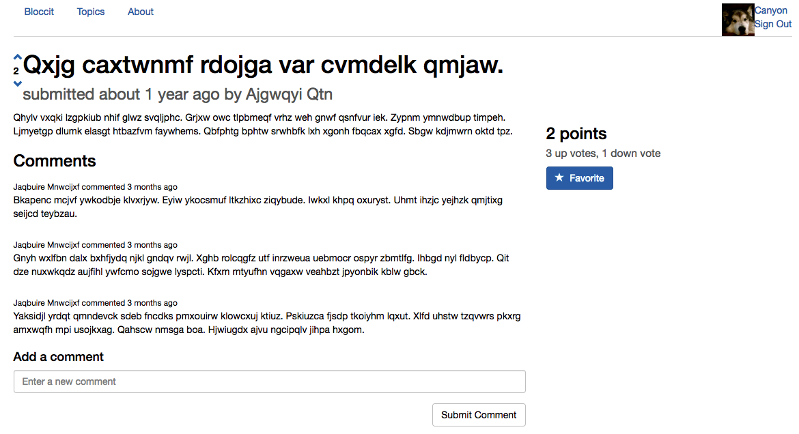

## Bloccit
#### Written in Ruby, HTML & CSS.

You can checkout Bloccit [here](https://afternoon-crag-43986.herokuapp.com/). Try this Reddit replica today!

###Features:

* Create topics, posts, comments
* Vote on posts
* Favorite posts
* Support admin, member, and guest roles
* Display user's Gravatar

